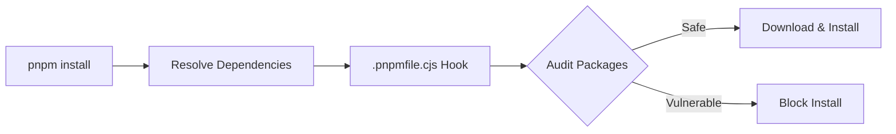
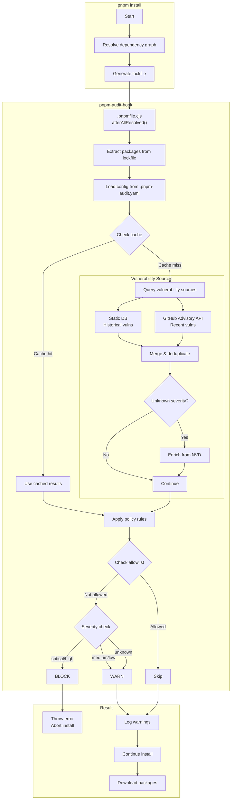
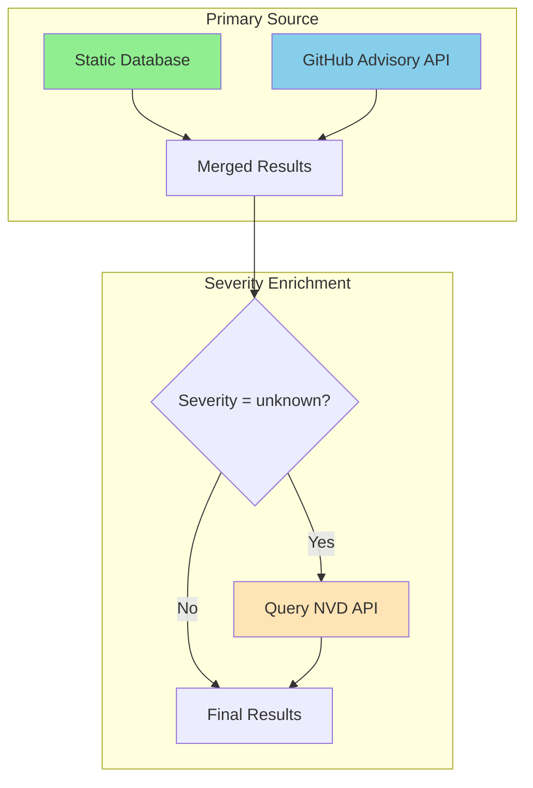
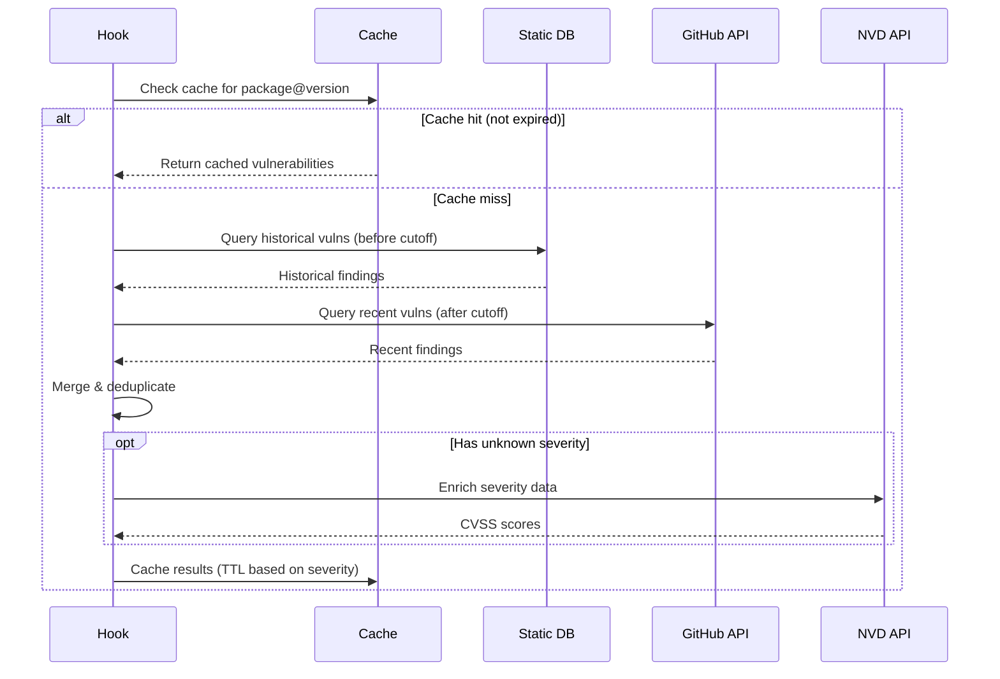
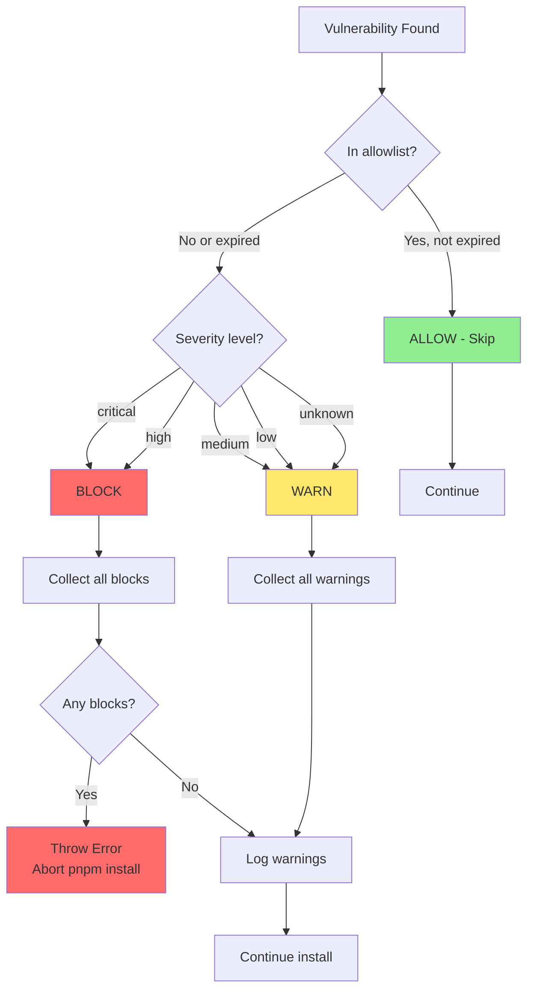
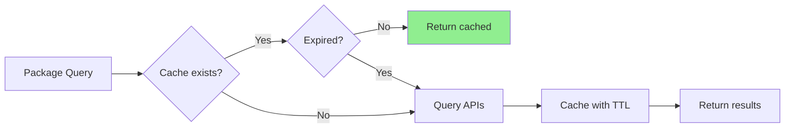
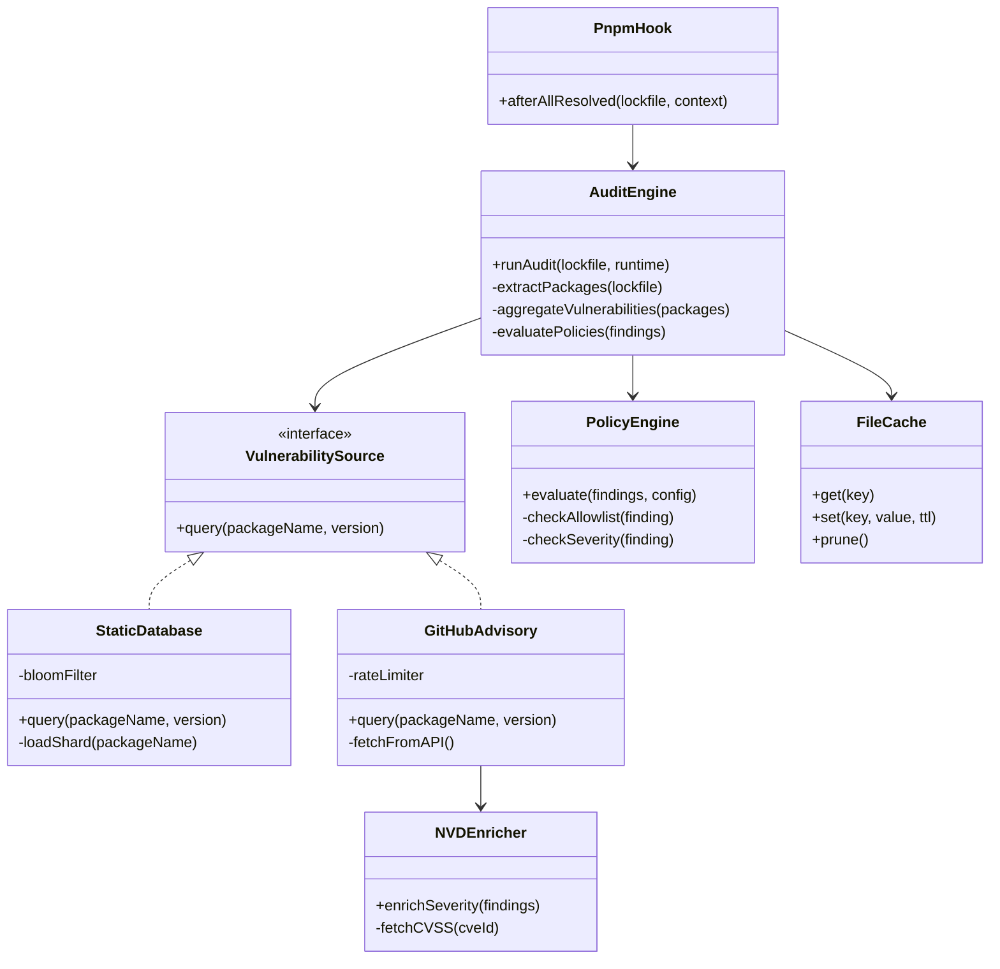

# pnpm-audit-hook

A pnpm hook that audits dependencies for vulnerabilities **before packages are downloaded**. It queries the GitHub Advisory Database and uses a bundled static vulnerability database, blocking installs when critical or high severity issues are found.

## Quick Start

```bash
pnpm add -D pnpm-audit-hook && pnpm exec pnpm-audit-setup
```

Done! Every `pnpm install` will now audit packages before downloading.

## How It Works

### Overview



When you run `pnpm install`, the hook intercepts the process **after dependency resolution but before downloading**. This means vulnerable packages are blocked without ever being downloaded to your machine.

### Detailed Flow



### Installation Changes

When you run `pnpm exec pnpm-audit-setup`, these files are created in your project:

| File | Purpose |
|------|---------|
| `.pnpmfile.cjs` | pnpm hook entry point - intercepts `pnpm install` |
| `.pnpm-audit.yaml` | Optional configuration file (created if missing) |
| `.pnpm-audit-cache/` | Cache directory (created automatically at runtime) |

### File Structure After Installation

```
your-project/
├── .pnpmfile.cjs          # Hook that pnpm loads automatically
├── .pnpm-audit.yaml       # Your security policy config (optional)
├── .pnpm-audit-cache/     # Cached vulnerability data (auto-created)
├── node_modules/
│   └── pnpm-audit-hook/   # The installed package
│       ├── dist/          # Compiled audit logic
│       └── .pnpmfile.cjs  # Template hook file
├── package.json
└── pnpm-lock.yaml
```

## Vulnerability Sources



| Source | Type | Description | Rate Limits |
|--------|------|-------------|-------------|
| **Static DB** | Bundled | Historical vulnerabilities (2020-2025), works offline | None |
| **GitHub Advisory** | API | Real-time vulnerability data from GHSA | 60/hr (no token), 5000/hr (with token) |
| **NVD** | API | Severity enrichment only (CVSS scores) | 5/30s (no key), 50/30s (with key) |

### Query Strategy



## Blocking Policy

### Default Policy

```yaml
policy:
  block:    # Abort install if found
    - critical
    - high
  warn:     # Log warning but continue
    - medium
    - low
    - unknown
```

### Policy Decision Flow



### Severity Levels

| Severity | CVSS Score | Default Action | Example |
|----------|------------|----------------|---------|
| **critical** | 9.0 - 10.0 | Block | Remote code execution |
| **high** | 7.0 - 8.9 | Block | Authentication bypass |
| **medium** | 4.0 - 6.9 | Warn | Information disclosure |
| **low** | 0.1 - 3.9 | Warn | Minor information leak |
| **unknown** | N/A | Warn | Severity not determined |

## Installation

### Per-Project (Recommended)

```bash
# 1. Install
pnpm add -D pnpm-audit-hook

# 2. Setup (creates .pnpmfile.cjs in your project)
pnpm exec pnpm-audit-setup
```

### Global (All Projects)

Enable vulnerability auditing for all pnpm projects on your machine:

```bash
# Install globally
pnpm add -g pnpm-audit-hook

# Create global hooks directory and copy files
mkdir -p ~/.pnpm-hooks
cp $(pnpm root -g)/pnpm-audit-hook/dist ~/.pnpm-hooks/ -r
cp $(pnpm root -g)/pnpm-audit-hook/.pnpmfile.cjs ~/.pnpm-hooks/

# Configure pnpm to use global hooks
pnpm config set global-pnpmfile ~/.pnpm-hooks/.pnpmfile.cjs
```

### From Source

```bash
git clone https://github.com/asx8678/pnpm-audit-hook.git
cd pnpm-audit-hook
pnpm install && pnpm run build

# Copy to your project
cp -r dist /path/to/your/project/
cp .pnpmfile.cjs /path/to/your/project/
```

## Verify Installation

```bash
# This should work (safe package)
pnpm add lodash

# This should be BLOCKED (known vulnerable)
pnpm add event-stream@3.3.6
```

If vulnerabilities are found, the install fails **before** any packages are downloaded.

## Uninstall

### Per-Project

```bash
rm .pnpmfile.cjs
pnpm remove pnpm-audit-hook
```

### Global

```bash
pnpm config delete global-pnpmfile
rm -rf ~/.pnpm-hooks
pnpm remove -g pnpm-audit-hook
```

## Configuration

Create `.pnpm-audit.yaml` in your project root:

```yaml
policy:
  block:
    - critical
    - high
  warn:
    - medium
    - low
    - unknown
  allowlist:
    - id: CVE-2024-12345
      reason: "False positive"
    - package: legacy-lib
      expires: "2025-06-01"

sources:
  github: true
  nvd: true

performance:
  timeoutMs: 15000

cache:
  ttlSeconds: 3600

staticBaseline:
  enabled: true
  cutoffDate: "2025-12-31"
```

All fields are optional. Defaults are applied for missing values.

### Configuration Options

| Option | Description | Default |
|--------|-------------|---------|
| `policy.block` | Severities that abort install | `["critical", "high"]` |
| `policy.warn` | Severities that log warnings | `["medium", "low", "unknown"]` |
| `policy.allowlist` | Exceptions to skip | `[]` |
| `sources.github` | Enable GitHub Advisory | `true` |
| `sources.nvd` | Enable NVD enrichment | `true` |
| `performance.timeoutMs` | API timeout (1-300,000) | `15000` |
| `cache.ttlSeconds` | Cache duration (1-86,400) | `3600` |
| `staticBaseline.enabled` | Use bundled vuln database | `true` |
| `staticBaseline.cutoffDate` | Static DB coverage date | `2025-12-31` |

## Allowlist

Suppress specific vulnerabilities or packages:

```yaml
policy:
  allowlist:
    # By CVE/GHSA ID
    - id: CVE-2024-12345
      reason: "False positive for our use case"

    # By package name
    - package: legacy-lib
      reason: "Accepted risk"
      expires: "2025-06-01"

    # Scoped: specific CVE in specific package
    - id: CVE-2024-12345
      package: affected-pkg
      version: ">=1.0.0 <2.0.0"  # Optional version constraint
      reason: "Only affects unused feature"
```

| Field | Required | Description |
|-------|----------|-------------|
| `id` | One of id/package | CVE or GHSA identifier (case-insensitive) |
| `package` | One of id/package | Package name to ignore (case-insensitive) |
| `version` | No | Semver range constraint |
| `reason` | No | Audit trail documentation |
| `expires` | No | ISO date when entry expires |

## Environment Variables

| Variable | Description |
|----------|-------------|
| `GITHUB_TOKEN` / `GH_TOKEN` | GitHub API token (higher rate limits) |
| `NVD_API_KEY` / `NIST_NVD_API_KEY` | NVD API key (higher rate limits) |
| `PNPM_AUDIT_CONFIG_PATH` | Custom config file location |
| `PNPM_AUDIT_DISABLE_GITHUB` | Disable GitHub Advisory source |
| `PNPM_AUDIT_QUIET` | Suppress info/warn output |
| `PNPM_AUDIT_DEBUG` | Enable debug logging |
| `PNPM_AUDIT_JSON` | JSON output format |

## Caching



### Cache Location

```
.pnpm-audit-cache/
├── ab/
│   └── ab1234...def.json    # Cached by SHA256 hash
├── cd/
│   └── cd5678...ghi.json
└── ...
```

### Dynamic TTL

Cache duration varies by severity to balance freshness and performance:

| Severity | TTL | Reason |
|----------|-----|--------|
| Critical | 15 min | Need fast response for active threats |
| High | 30 min | Important but less urgent |
| Medium | 1 hour | Standard caching |
| Low/Unknown | Config TTL | Use configured default |

## CI/CD Integration

### GitHub Actions

```yaml
name: Install with Audit
on: [push, pull_request]

jobs:
  install:
    runs-on: ubuntu-latest
    steps:
      - uses: actions/checkout@v4
      - uses: pnpm/action-setup@v4
      - uses: actions/setup-node@v4
        with:
          node-version: 20
          cache: pnpm
      - run: pnpm install
        env:
          GITHUB_TOKEN: ${{ secrets.GITHUB_TOKEN }}
          NVD_API_KEY: ${{ secrets.NVD_API_KEY }}
```

The hook runs automatically during `pnpm install` and will fail the job if blocking vulnerabilities are found.

## Static Vulnerability Database

The hook includes a bundled database of historical vulnerabilities (2020-2025) that enables faster audits and reduced API calls.

### Benefits

- **Faster audits**: No API calls needed for known historical vulnerabilities
- **Offline capability**: Historical vulnerability checks work without internet
- **Rate limit friendly**: Minimizes API usage
- **Reliable**: Not affected by API outages for historical data

### Updating the Database

```bash
# Incremental update (recommended)
pnpm run update-vuln-db:incremental

# Full rebuild
pnpm run update-vuln-db

# Rebuild and commit
pnpm run build
git add src/static-db/data/ dist/static-db/data/
git commit -m "chore: update vulnerability database"
```

## Architecture



## Security Model

### Fail-Closed Design

The hook uses a **fail-closed** security model:

| Condition | Behavior |
|-----------|----------|
| API failure | Block install (configurable) |
| Invalid allowlist entry | Entry ignored (treated as not allowed) |
| Expired allowlist | Entry ignored |
| Unknown severity | Treated as "warn" (configurable) |
| Invalid semver in vuln data | Treated as potentially affected |

### Security Features

- **Pre-download blocking**: Vulnerable code never reaches your machine
- **No credential storage**: API keys only from environment variables
- **Path traversal protection**: Validates all file paths
- **Symlink attack prevention**: Detects symlinks in cache
- **Atomic cache writes**: Prevents partial/corrupted cache files

## Local Development

### Setup

```bash
git clone https://github.com/asx8678/pnpm-audit-hook.git
cd pnpm-audit-hook
pnpm install
pnpm run build
```

### Test Directly

```bash
pnpm run build
pnpm add lodash              # Safe package
pnpm add event-stream@3.3.6  # Vulnerable - should be blocked
```

### Run Tests

```bash
pnpm test
```

## Exit Codes

| Code | Meaning |
|------|---------|
| 0 | Success - no blocking vulnerabilities |
| 1 | Blocked - critical/high vulnerabilities found |
| 2 | Warnings - medium/low vulnerabilities found |
| 3 | Source error - API failure (fail-closed) |

## License

MIT
