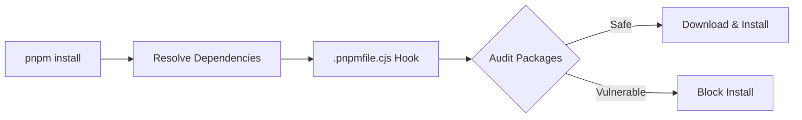
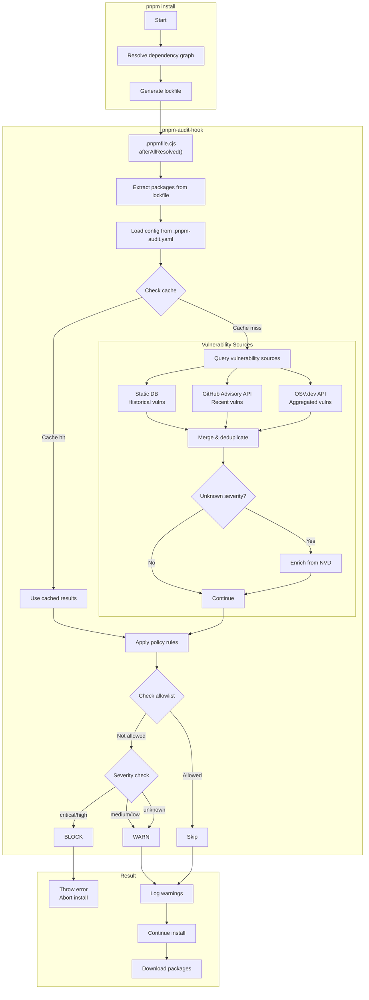
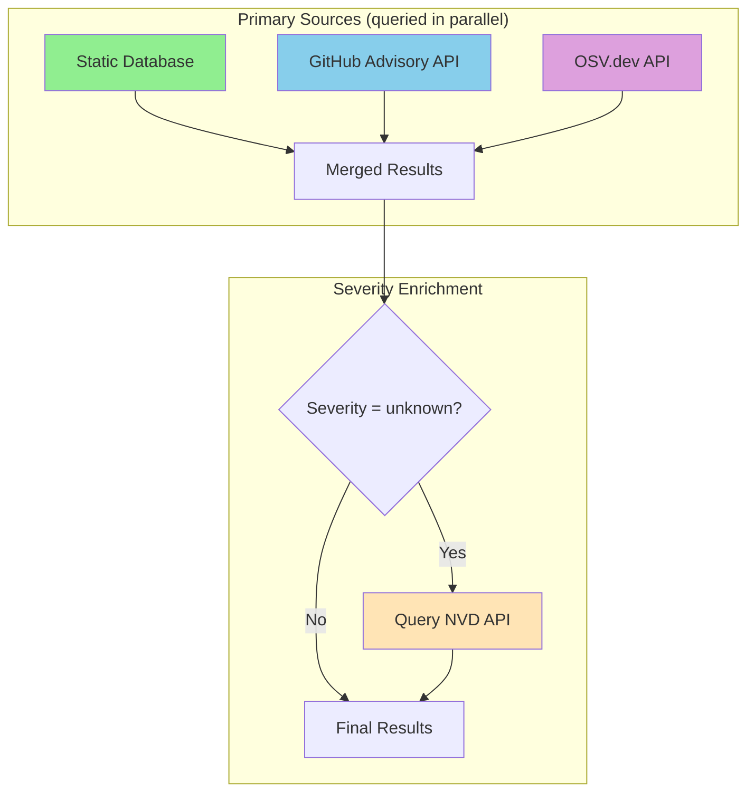
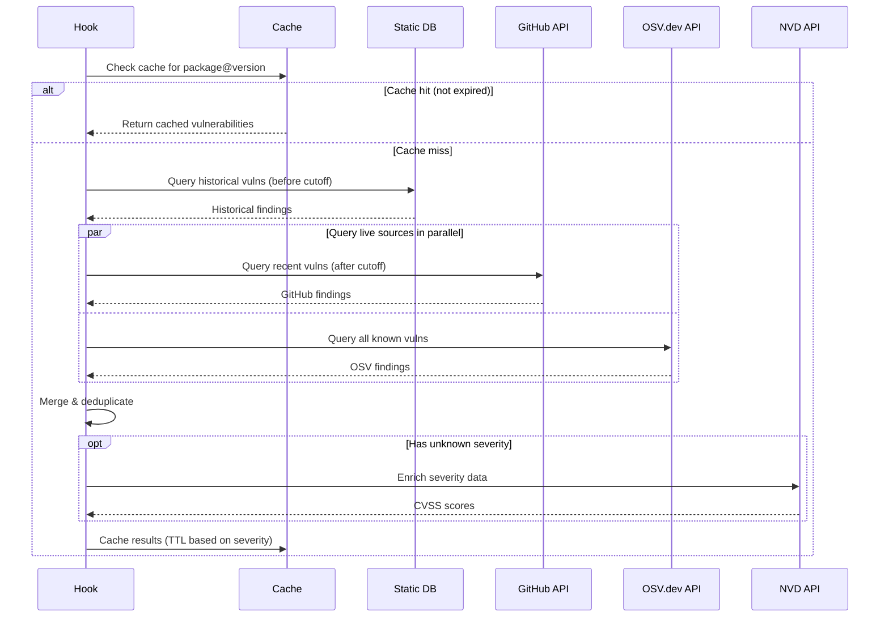
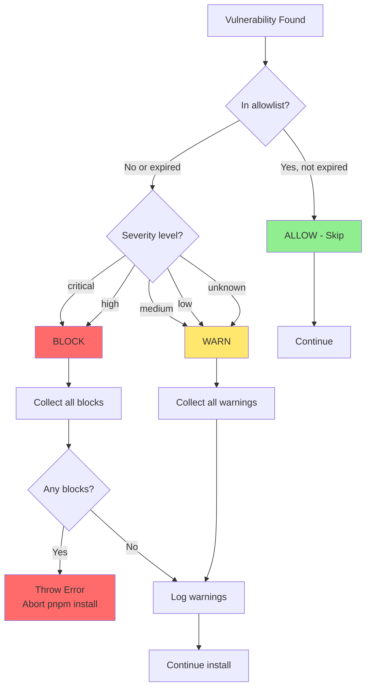
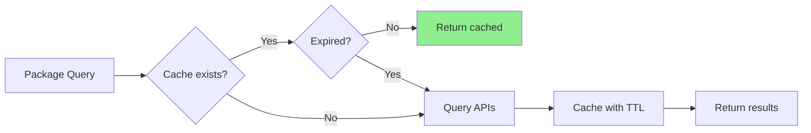
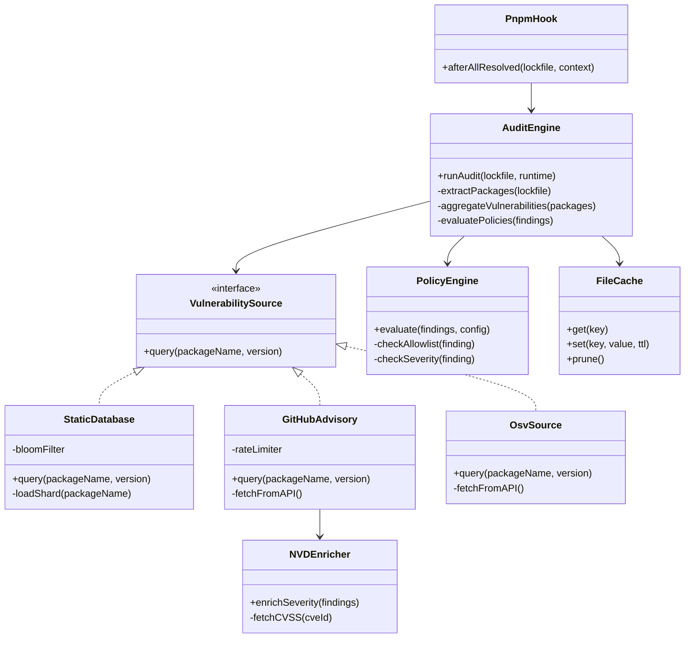

# pnpm-audit-hook

A pnpm hook that audits dependencies for vulnerabilities **before packages are downloaded**. It queries the GitHub Advisory Database, OSV.dev, and uses a bundled static vulnerability database, blocking installs when critical or high severity issues are found.

## Quick Start

```bash
pnpm add -D pnpm-audit-hook && pnpm exec pnpm-audit-setup
```

Done! Every `pnpm install` will now audit packages before downloading.

## Quick How-To

### Enable/Disable Vulnerability Sources

```yaml
# .pnpm-audit.yaml
sources:
  github: true    # GitHub Advisory Database (default: true)
  osv: true       # OSV.dev — aggregates GHSA + npm + more (default: true)
  nvd: true       # NVD severity enrichment only (default: true)
```

Or via environment variables:
```bash
PNPM_AUDIT_DISABLE_GITHUB=true pnpm install   # Skip GitHub Advisory
PNPM_AUDIT_DISABLE_OSV=true pnpm install       # Skip OSV.dev
```

### Run an Offline Audit (No Network)

```bash
# Use only the bundled static database
pnpm-audit-scan --offline

# Or set the environment variable
PNPM_AUDIT_OFFLINE=true pnpm install
```

### Update the Vulnerability Database

```bash
# Quick incremental update (recommended)
pnpm-audit-scan --update-db

# Full rebuild from scratch
pnpm-audit-scan --update-db=full

# Or via npm scripts (equivalent)
GITHUB_TOKEN=your_token pnpm run update-vuln-db:incremental
```

### Scan Without Installing

```bash
# Run audit manually on current lockfile
pnpm-audit-scan

# Output as JSON for CI parsing
pnpm-audit-scan --format json

# Only block on critical vulnerabilities
pnpm-audit-scan --severity critical
```

### Allowlist a Known Vulnerability

```yaml
# .pnpm-audit.yaml
policy:
  allowlist:
    - id: CVE-2024-12345
      reason: "False positive — we don't use the affected API"
      expires: "2025-12-31"
```

## How It Works

### Overview


```mermaid
flowchart LR
    A[pnpm install] --> B[Resolve Dependencies]
    B --> C[.pnpmfile.cjs Hook]
    C --> D{Audit Packages}
    D -->|Safe| E[Download & Install]
    D -->|Vulnerable| F[Block Install]
```

When you run `pnpm install`, the hook intercepts the process **after dependency resolution but before downloading**. This means vulnerable packages are blocked without ever being downloaded to your machine.

### Detailed Flow


```mermaid
flowchart TD
    subgraph PNPM["pnpm install"]
        A[Start] --> B[Resolve dependency graph]
        B --> C[Generate lockfile]
    end

    subgraph HOOK["pnpm-audit-hook"]
        C --> D[".pnpmfile.cjs<br/>afterAllResolved()"]
        D --> E[Extract packages from lockfile]
        E --> F[Load config from .pnpm-audit.yaml]
        F --> G{Check cache}
        G -->|Cache hit| H[Use cached results]
        G -->|Cache miss| I[Query vulnerability sources]

        subgraph SOURCES["Vulnerability Sources"]
            I --> J[Static DB<br/>Historical vulns]
            I --> K[GitHub Advisory API<br/>Recent vulns]
            I --> K2[OSV.dev API<br/>Aggregated vulns]
            J --> L[Merge & deduplicate]
            K --> L
            K2 --> L
            L --> M{Unknown severity?}
            M -->|Yes| N[Enrich from NVD]
            M -->|No| O[Continue]
            N --> O
        end

        H --> P[Apply policy rules]
        O --> P
        P --> Q{Check allowlist}
        Q -->|Allowed| R[Skip]
        Q -->|Not allowed| S{Severity check}
        S -->|critical/high| T[BLOCK]
        S -->|medium/low| U[WARN]
        S -->|unknown| U
    end

    subgraph RESULT["Result"]
        T --> V[Throw error<br/>Abort install]
        U --> W[Log warnings]
        R --> W
        W --> X[Continue install]
        X --> Y[Download packages]
    end
```

### Installation Changes

When you run `pnpm exec pnpm-audit-setup`, these files are created in your project:

| File | Purpose |
|------|---------|
| `.pnpmfile.cjs` | pnpm hook entry point - intercepts `pnpm install` |
| `.pnpm-audit.yaml` | Optional configuration file (created if missing) |
| `.pnpm-audit-cache/` | Cache directory (created automatically at runtime) |

### File Structure After Installation

```
your-project/
├── .pnpmfile.cjs          # Hook that pnpm loads automatically
├── .pnpm-audit.yaml       # Your security policy config (optional)
├── .pnpm-audit-cache/     # Cached vulnerability data (auto-created)
├── node_modules/
│   └── pnpm-audit-hook/   # The installed package
│       ├── dist/          # Compiled audit logic
│       └── .pnpmfile.cjs  # Template hook file
├── package.json
└── pnpm-lock.yaml
```

## Vulnerability Sources


```mermaid
flowchart TD
    subgraph PRIMARY["Primary Sources (queried in parallel)"]
        A[Static Database] --> D[Merged Results]
        B[GitHub Advisory API] --> D
        C[OSV.dev API] --> D
    end

    subgraph ENRICHMENT["Severity Enrichment"]
        D --> E{Severity = unknown?}
        E -->|Yes| F[Query NVD API]
        E -->|No| G[Final Results]
        F --> G
    end

    style A fill:#90EE90
    style B fill:#87CEEB
    style C fill:#DDA0DD
    style F fill:#FFE4B5
```

| Source | Type | Description | Rate Limits |
|--------|------|-------------|-------------|
| **Static DB** | Bundled | Historical vulnerabilities (2020-2025), works offline, gzip-compressed with integrity hashes | None |
| **GitHub Advisory** | API | Real-time vulnerability data from GHSA | 60/hr (no token), 5000/hr (with token) |
| **OSV.dev** | API | Aggregated vulnerabilities from multiple databases (GHSA, npm, etc.). Free, no auth required | Generous (no key needed) |
| **NVD** | API | Severity enrichment only (CVSS scores) | 5/30s (no key), 50/30s (with key) |

### Query Strategy


```mermaid
sequenceDiagram
    participant H as Hook
    participant C as Cache
    participant S as Static DB
    participant G as GitHub API
    participant O as OSV.dev API
    participant N as NVD API

    H->>C: Check cache for package@version
    alt Cache hit (not expired)
        C-->>H: Return cached vulnerabilities
    else Cache miss
        H->>S: Query historical vulns (before cutoff)
        S-->>H: Historical findings
        par Query live sources in parallel
            H->>G: Query recent vulns (after cutoff)
            G-->>H: GitHub findings
        and
            H->>O: Query all known vulns
            O-->>H: OSV findings
        end
        H->>H: Merge & deduplicate

        opt Has unknown severity
            H->>N: Enrich severity data
            N-->>H: CVSS scores
        end

        H->>C: Cache results (TTL based on severity)
    end
```

## Blocking Policy

### Default Policy

```yaml
policy:
  block:    # Abort install if found
    - critical
    - high
  warn:     # Log warning but continue
    - medium
    - low
    - unknown
```

### Policy Decision Flow


```mermaid
flowchart TD
    A[Vulnerability Found] --> B{In allowlist?}
    B -->|Yes, not expired| C[ALLOW - Skip]
    B -->|No or expired| D{Severity level?}

    D -->|critical| E[BLOCK]
    D -->|high| E
    D -->|medium| F[WARN]
    D -->|low| F
    D -->|unknown| F

    E --> G[Collect all blocks]
    F --> H[Collect all warnings]
    C --> I[Continue]

    G --> J{Any blocks?}
    J -->|Yes| K[Throw Error<br/>Abort pnpm install]
    J -->|No| L[Log warnings]
    H --> L
    L --> M[Continue install]

    style E fill:#FF6B6B
    style F fill:#FFE66D
    style C fill:#90EE90
    style K fill:#FF6B6B
```

### Severity Levels

| Severity | CVSS Score | Default Action | Example |
|----------|------------|----------------|---------|
| **critical** | 9.0 - 10.0 | Block | Remote code execution |
| **high** | 7.0 - 8.9 | Block | Authentication bypass |
| **medium** | 4.0 - 6.9 | Warn | Information disclosure |
| **low** | 0.1 - 3.9 | Warn | Minor information leak |
| **unknown** | N/A | Warn | Severity not determined |

## Prerequisites

- **Node.js** ≥ 18
- **pnpm** (any version that supports `.pnpmfile.cjs` — pnpm 6+)

> **Note**: This tool is designed for pnpm only. For npm projects, use `npm audit`. For yarn, use `yarn audit`.

## Installation

### Per-Project (Recommended)

```bash
# Step 1: Install as a dev dependency
pnpm add -D pnpm-audit-hook

# Step 2: Run the setup script to create the hook file
pnpm exec pnpm-audit-setup
```

**What this does:**
1. Installs the package into `node_modules/`
2. Creates `.pnpmfile.cjs` in your project root — this is the hook that pnpm loads automatically
3. Creates `.pnpm-audit.yaml` — your security policy config (optional, sensible defaults applied)

**Files to commit:**
```bash
git add .pnpmfile.cjs .pnpm-audit.yaml
echo ".pnpm-audit-cache/" >> .gitignore
git add .gitignore
```

### Global (All Projects)

Enable vulnerability auditing for every pnpm project on your machine:

```bash
# 1. Install globally
pnpm add -g pnpm-audit-hook

# 2. Create global hooks directory and copy files
mkdir -p ~/.pnpm-hooks
cp $(pnpm root -g)/pnpm-audit-hook/dist ~/.pnpm-hooks/ -r
cp $(pnpm root -g)/pnpm-audit-hook/.pnpmfile.cjs ~/.pnpm-hooks/

# 3. Tell pnpm to use the global hook
pnpm config set global-pnpmfile ~/.pnpm-hooks/.pnpmfile.cjs
```

### From Source

```bash
git clone https://github.com/asx8678/pnpm-audit-hook.git
cd pnpm-audit-hook
pnpm install && pnpm run build

# Copy to your project
cp -r dist /path/to/your/project/
cp .pnpmfile.cjs /path/to/your/project/
```

### Upgrading from v1.1.0

If upgrading from v1.1.0, note these changes:
- **OSV.dev is now enabled by default** — adds a new vulnerability source alongside GitHub Advisory. To disable: set `sources.osv: false` in `.pnpm-audit.yaml` or `PNPM_AUDIT_DISABLE_OSV=true`
- **Cache keys changed** — a one-time cache rebuild will happen automatically (no action needed)
- **More vulnerabilities may be found** — OSV.dev aggregates GHSA + npm + other databases, so previously-clean installs may now report new findings

## Verify Installation

```bash
# ✅ This should succeed (safe package)
pnpm add lodash

# 🚫 This should be BLOCKED (known vulnerable version)
pnpm add event-stream@3.3.6
```

When a vulnerability is blocked, you'll see output like this:

```
===============================================
           PNPM AUDIT SECURITY REPORT
===============================================

Source Status:
  github: OK (245ms)
  osv: OK (180ms)

Package Summary:
  Total packages scanned: 1
  Safe packages: 0
  Packages with vulnerabilities: 1

Vulnerabilities by Severity:
  CRITICAL: 1

Vulnerability Details:
  [CRITICAL] GHSA-xxxx-xxxx-xxxx
    Package: event-stream@3.3.6
    Title: Malicious Package in event-stream
    Affected: =3.3.6
    Fixed in: 4.0.0

===============================================
AUDIT FAILED - Installation blocked
===============================================
```

When everything is clean:

```
[pnpm-audit] Starting audit of 42 packages
[pnpm-audit] ✓ No vulnerabilities found (312ms)
```

## Usage

### Per-Project

```bash
rm .pnpmfile.cjs
pnpm remove pnpm-audit-hook
```

### Global

```bash
pnpm config delete global-pnpmfile
rm -rf ~/.pnpm-hooks
pnpm remove -g pnpm-audit-hook
```

## Configuration

Create `.pnpm-audit.yaml` in your project root:

```yaml
policy:
  block:
    - critical
    - high
  warn:
    - medium
    - low
    - unknown
  allowlist:
    - id: CVE-2024-12345
      reason: "False positive"
    - package: legacy-lib
      expires: "2025-06-01"

sources:
  github: true
  osv: true
  nvd: true

performance:
  timeoutMs: 15000

cache:
  ttlSeconds: 3600

staticBaseline:
  enabled: true
  cutoffDate: "2025-12-31"
```

All fields are optional. Defaults are applied for missing values.

### Configuration Options

| Option | Description | Default |
|--------|-------------|---------|
| `policy.block` | Severities that abort install | `["critical", "high"]` |
| `policy.warn` | Severities that log warnings | `["medium", "low", "unknown"]` |
| `policy.allowlist` | Exceptions to skip | `[]` |
| `sources.github` | Enable GitHub Advisory | `true` |
| `sources.osv` | Enable OSV.dev source | `true` |
| `sources.nvd` | Enable NVD enrichment | `true` |
| `performance.timeoutMs` | API timeout (1-300,000) | `15000` |
| `cache.ttlSeconds` | Cache duration (1-86,400) | `3600` |
| `staticBaseline.enabled` | Use bundled vuln database | `true` |
| `staticBaseline.cutoffDate` | Static DB coverage date | `2025-12-31` |

## Allowlist

Suppress specific vulnerabilities or packages:

```yaml
policy:
  allowlist:
    # By CVE/GHSA ID
    - id: CVE-2024-12345
      reason: "False positive for our use case"

    # By package name
    - package: legacy-lib
      reason: "Accepted risk"
      expires: "2025-06-01"

    # Scoped: specific CVE in specific package
    - id: CVE-2024-12345
      package: affected-pkg
      version: ">=1.0.0 <2.0.0"  # Optional version constraint
      reason: "Only affects unused feature"
```

| Field | Required | Description |
|-------|----------|-------------|
| `id` | One of id/package | CVE or GHSA identifier (case-insensitive) |
| `package` | One of id/package | Package name to ignore (case-insensitive) |
| `version` | No | Semver range constraint |
| `reason` | No | Audit trail documentation |
| `expires` | No | ISO date when entry expires |

## Environment Variables

| Variable | Description |
|----------|-------------|
| `GITHUB_TOKEN` / `GH_TOKEN` | GitHub API token (higher rate limits) |
| `NVD_API_KEY` / `NIST_NVD_API_KEY` | NVD API key (higher rate limits) |
| `PNPM_AUDIT_CONFIG_PATH` | Custom config file location |
| `PNPM_AUDIT_DISABLE_GITHUB` | Disable GitHub Advisory source |
| `PNPM_AUDIT_DISABLE_OSV` | Disable OSV.dev source |
| `PNPM_AUDIT_QUIET` | Suppress info/warn output |
| `PNPM_AUDIT_DEBUG` | Enable debug logging |
| `PNPM_AUDIT_VERBOSE` | Enable verbose logging |
| `PNPM_AUDIT_JSON` | JSON output format |
| `PNPM_AUDIT_FORMAT` | Output format (`human`, `azure`, `github`, `json`) |
| `PNPM_AUDIT_OFFLINE` | Use only static baseline DB (no network) |
| `PNPM_AUDIT_FAIL_ON_NO_SOURCES` | Fail if no advisory sources available (default: `true`) |
| `PNPM_AUDIT_FAIL_ON_SOURCE_ERROR` | Fail if an advisory source errors (default: `true`) |
| `PNPM_AUDIT_GITHUB_CONCURRENCY` | Max concurrent GitHub API requests (default: `10` with token, `3` without) |

## CLI Reference

The `pnpm-audit-scan` CLI supports these flags:

| Flag | Description |
|------|-------------|
| `--format <format>` | Output format: `human`, `json`, `azure`, `github` (default: `human`) |
| `--severity <list>` | Comma-separated severity levels to block (default: `critical,high`) |
| `--offline` | Skip live API calls, use only static DB + cache |
| `--update-db` | Update vulnerability database (incremental) |
| `--update-db=full` | Update vulnerability database (full rebuild) |
| `--quiet` | Suppress non-error output |
| `--verbose` | Enable verbose output |
| `--debug` | Enable debug output |
| `--config <path>` | Path to `.pnpm-audit.yaml` config file |
| `--help` | Show help text |
| `--version` | Show version |

When `--update-db` is passed, the DB update runs and the CLI exits (no audit is performed).

## Caching


```mermaid
flowchart LR
    A[Package Query] --> B{Cache exists?}
    B -->|Yes| C{Expired?}
    C -->|No| D[Return cached]
    C -->|Yes| E[Query APIs]
    B -->|No| E
    E --> F[Cache with TTL]
    F --> G[Return results]

    style D fill:#90EE90
```

### Cache Location

```
.pnpm-audit-cache/
├── ab/
│   └── ab1234...def.json    # Cached by SHA256 hash
├── cd/
│   └── cd5678...ghi.json
└── ...
```

### Dynamic TTL

Cache duration varies by severity to balance freshness and performance:

| Severity | TTL | Reason |
|----------|-----|--------|
| Critical | 15 min | Need fast response for active threats |
| High | 30 min | Important but less urgent |
| Medium | 1 hour | Standard caching |
| Low/Unknown | Config TTL | Use configured default |

## CI/CD Integration

### GitHub Actions

```yaml
name: Install with Audit
on: [push, pull_request]

jobs:
  install:
    runs-on: ubuntu-latest
    steps:
      - uses: actions/checkout@v4
      - uses: pnpm/action-setup@v4
      - uses: actions/setup-node@v4
        with:
          node-version: 20
          cache: pnpm
      - run: pnpm install
        env:
          GITHUB_TOKEN: ${{ secrets.GITHUB_TOKEN }}
          NVD_API_KEY: ${{ secrets.NVD_API_KEY }}
```

The hook runs automatically during `pnpm install` and will fail the job if blocking vulnerabilities are found.

The GitHub Actions format emits `::error::` / `::warning::` annotations for findings and sets outputs via `$GITHUB_OUTPUT` for downstream steps:

| Output | Description |
|--------|-------------|
| `audit-blocked` | `true` if install is blocked |
| `vulnerability-count` | Total number of vulnerabilities |
| `critical-count` | Number of critical vulnerabilities |
| `high-count` | Number of high vulnerabilities |

### Azure DevOps

```yaml
trigger:
  - main

pool:
  vmImage: ubuntu-latest

steps:
  - task: NodeTool@0
    inputs:
      version: 20
  - script: |
      npm install -g pnpm
      pnpm install
    displayName: 'Install with Audit'
    env:
      GITHUB_TOKEN: $(GITHUB_TOKEN)
      NVD_API_KEY: $(NVD_API_KEY)
      PNPM_AUDIT_FORMAT: azure
```

The Azure DevOps format uses `##[group]`, `##[error]`, `##[warning]`, and `##vso[task.setvariable]` logging commands for pipeline annotations and variables. It is also auto-detected when running in Azure Pipelines (`TF_BUILD=True`).

| Variable | Description |
|----------|-------------|
| `AUDIT_BLOCKED` | `true` if install is blocked |
| `AUDIT_VULNERABILITY_COUNT` | Total number of vulnerabilities |
| `AUDIT_CRITICAL_COUNT` | Number of critical vulnerabilities |
| `AUDIT_HIGH_COUNT` | Number of high vulnerabilities |

## Static Vulnerability Database

The hook includes a bundled database of historical vulnerabilities (2020-2025) that enables faster audits and reduced API calls.

### Benefits

- **Faster audits**: No API calls needed for known historical vulnerabilities
- **Offline capability**: Historical vulnerability checks work without internet
- **Rate limit friendly**: Minimizes API usage
- **Reliable**: Not affected by API outages for historical data

### Database Integrity

The static database includes SHA-256 integrity hashes for all vulnerability shard files, computed at build time and embedded in the index. This protects against tampering — if a shard file in `node_modules` is modified to suppress known vulnerabilities, the integrity check will detect it.

- Hashes are computed during `pnpm run build` by the optimizer
- Stored in the compressed index alongside package metadata
- Verified transparently at load time by the reader

### Database Compression

The static database is automatically optimized during the build process:

- **Index optimization**: Field names are compacted (e.g., `schemaVersion` → `ver`, `packages` → `p`) reducing index size by ~80%
- **Gzip compression**: Shard files larger than 10 KB are gzip-compressed (`.json.gz`), reducing the npm tarball by ~3-5x
- **Transparent reading**: The reader handles both `.json.gz` and `.json` formats automatically — no configuration needed

The optimization runs automatically during `pnpm run build` via `scripts/optimize-static-db.js`.

### Updating the Database

```bash
# Using the CLI (recommended — more discoverable)
pnpm-audit-scan --update-db           # Incremental update
pnpm-audit-scan --update-db=full      # Full rebuild

# Or via npm scripts
pnpm run update-vuln-db:incremental   # Incremental update
pnpm run update-vuln-db               # Full rebuild

# Rebuild and commit
pnpm run build
git add src/static-db/data/ dist/static-db/data/
git commit -m "chore: update vulnerability database"
```

## Architecture


```mermaid
classDiagram
    class PnpmHook {
        +afterAllResolved(lockfile, context)
    }

    class AuditEngine {
        +runAudit(lockfile, runtime)
        -extractPackages(lockfile)
        -aggregateVulnerabilities(packages)
        -evaluatePolicies(findings)
    }

    class VulnerabilitySource {
        <<interface>>
        +query(packageName, version)
    }

    class StaticDatabase {
        +query(packageName, version)
        -loadShard(packageName)
        -bloomFilter
    }

    class GitHubAdvisory {
        +query(packageName, version)
        -fetchFromAPI()
        -rateLimiter
    }

    class OsvSource {
        +query(packageName, version)
        -fetchFromAPI()
    }

    class NVDEnricher {
        +enrichSeverity(findings)
        -fetchCVSS(cveId)
    }

    class PolicyEngine {
        +evaluate(findings, config)
        -checkAllowlist(finding)
        -checkSeverity(finding)
    }

    class FileCache {
        +get(key)
        +set(key, value, ttl)
        +prune()
    }

    PnpmHook --> AuditEngine
    AuditEngine --> VulnerabilitySource
    AuditEngine --> PolicyEngine
    AuditEngine --> FileCache
    VulnerabilitySource <|.. StaticDatabase
    VulnerabilitySource <|.. GitHubAdvisory
    VulnerabilitySource <|.. OsvSource
    GitHubAdvisory --> NVDEnricher
```

## Security Model

### Fail-Closed Design

The hook uses a **fail-closed** security model:

| Condition | Behavior |
|-----------|----------|
| API failure | Block install (configurable) |
| Invalid allowlist entry | Entry ignored (treated as not allowed) |
| Expired allowlist | Entry ignored |
| Unknown severity | Treated as "warn" (configurable) |
| Invalid semver in vuln data | Treated as potentially affected |

### Security Features

- **Pre-download blocking**: Vulnerable code never reaches your machine
- **No credential storage**: API keys only from environment variables
- **Path traversal protection**: Validates all file paths
- **Symlink attack prevention**: Detects symlinks in cache
- **Atomic cache writes**: Prevents partial/corrupted cache files
- **Database integrity verification**: SHA-256 hashes detect tampered vulnerability data
- **Cache key versioning**: DB updates automatically invalidate stale cached results

## Local Development

### Setup

```bash
git clone https://github.com/asx8678/pnpm-audit-hook.git
cd pnpm-audit-hook
pnpm install
pnpm run build
```

### Test Directly

```bash
pnpm run build
pnpm add lodash              # Safe package
pnpm add event-stream@3.3.6  # Vulnerable - should be blocked
```

### Run Tests

```bash
pnpm test
```

## Exit Codes

| Code | Meaning |
|------|---------|
| 0 | Success - no blocking vulnerabilities |
| 1 | Blocked - critical/high vulnerabilities found |
| 2 | Warnings - medium/low vulnerabilities found |
| 3 | Source error - API failure (fail-closed) |

## License

MIT
