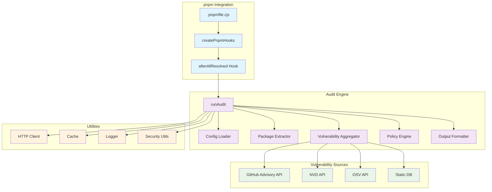
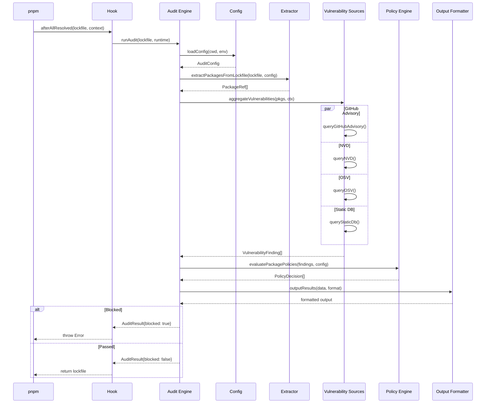
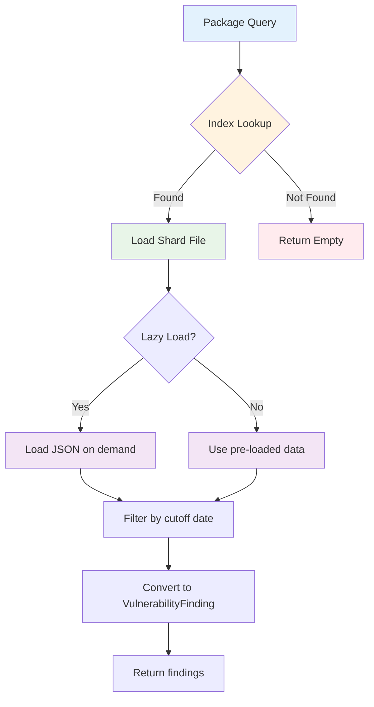
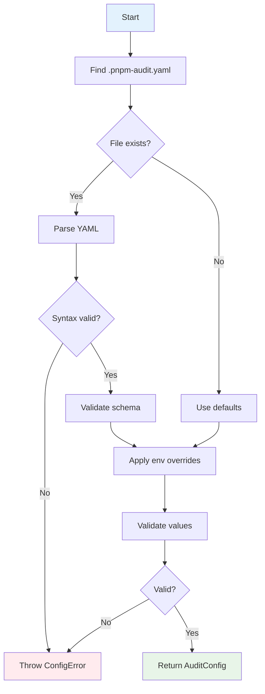

# pnpm-audit-hook Architecture

Welcome to the architecture documentation for `pnpm-audit-hook`! 🐶

This document provides a high-level overview of the system, designed to help new contributors understand the codebase and make informed design decisions.

## Table of Contents

- [System Overview](#system-overview)
- [Core Components](#core-components)
- [Data Flow](#data-flow)
- [Design Decisions](#design-decisions)
- [Design Patterns](#design-patterns)
- [Contributor Guide](#contributor-guide)

## System Overview

`pnpm-audit-hook` is a security tool that intercepts pnpm's package installation process to audit dependencies for known vulnerabilities. It acts as a pre-download security gate, blocking vulnerable packages before they are installed.

### Key Features

1. **Multi-Source Aggregation**: Queries GitHub Advisory Database, NVD, and OSV
2. **Offline Support**: Includes a static vulnerability database for air-gapped environments
3. **Policy Engine**: Configurable blocking/warning rules based on severity
4. **Performance Optimized**: Lazy loading, caching, and concurrency controls
5. **CI/CD Ready**: Native output formats for GitHub Actions, Azure DevOps, and AWS CodeBuild

### System Architecture Diagram



## Core Components

### 1. Hook System (`src/index.ts`)

The entry point that integrates with pnpm's lifecycle hooks:

```typescript
export function createPnpmHooks(): PnpmHooks {
  return {
    hooks: {
      afterAllResolved: async (lockfile, context) => {
        // Run audit, throw if blocked
        return lockfile;
      },
    },
  };
}
```

**Responsibilities:**
- Create pnpm-compatible hooks object
- Extract runtime context (cwd, env, registry)
- Throw descriptive errors when blocking

### 2. Audit Engine (`src/audit.ts`)

Orchestrates the entire audit process:

```typescript
export async function runAudit(
  lockfile: PnpmLockfile,
  runtime: RuntimeOptions
): Promise<AuditResult>
```

**Responsibilities:**
- Load and validate configuration
- Extract packages from lockfile
- Aggregate vulnerabilities from multiple sources
- Apply policy rules
- Format and output results

### 3. Configuration (`src/config.ts`)

Handles YAML configuration loading with environment variable overrides:

```typescript
export async function loadConfig(opts: ConfigLoadOptions): Promise<AuditConfig>
```

**Features:**
- YAML file parsing with syntax validation
- Environment variable overrides (e.g., `PNPM_AUDIT_BLOCK_SEVERITY`)
- Allowlist with expiration dates
- Typo detection with suggestions
- Path traversal protection

### 4. Package Extractor (`src/utils/lockfile/`)

Extracts package information from pnpm lockfiles:

```typescript
export function extractPackagesFromLockfile(
  lockfile: PnpmLockfile,
  config: AuditConfig
): PackageRef[]
```

**Features:**
- Supports pnpm lockfile v6, v8, v9 formats
- Workspace package handling
- Dev dependency filtering
- Parse caching for performance

### 5. Vulnerability Aggregator (`src/databases/`)

Coordinates queries to multiple vulnerability sources:

```typescript
export async function aggregateVulnerabilities(
  pkgs: PackageRef[],
  ctx: AggregateContext
): Promise<AggregateResult>
```

**Sources:**
| Source | API | Rate Limits | Offline Support |
|--------|-----|-------------|-----------------|
| GitHub Advisory | REST v4 | 100/min (authenticated) | ✅ Static DB |
| NVD | REST 2.0 | 5 req/30s | ❌ |
| OSV | REST v1 | Unlimited | ❌ |
| Static DB | Local JSON | Unlimited | ✅ |

### 6. Policy Engine (`src/policies/policy-engine.ts`)

Evaluates vulnerability findings against configured policies:

```typescript
export function evaluatePackagePolicies(
  findings: VulnerabilityFinding[],
  config: AuditConfig,
  graph?: DependencyGraph
): PolicyDecision[]
```

**Policy Rules:**
- **Severity-based**: Block/warn/allow by severity level
- **Allowlist**: Package or CVE-specific exceptions
- **Direct-only**: Allowlist entries that only apply to direct dependencies
- **Expiration**: Time-based allowlist entry expiration

### 7. Output Formatter (`src/utils/output-formatter.ts`)

Formats audit results for different environments:

```typescript
export function outputResults(
  data: AuditOutputData,
  format?: OutputFormat
): string
```

**Formats:**
- **Human-readable**: Color-coded terminal output
- **GitHub Actions**: `::error` and `::warning` annotations
- **Azure DevOps**: `##vso[task.logissue]` commands
- **AWS CodeBuild**: CloudWatch-compatible format
- **JSON**: Machine-readable for CI pipelines

## Data Flow

### 1. Installation Audit Flow



### 2. Static Database Query Flow



### 3. Configuration Loading Flow



## Design Decisions

See [decisions.md](./decisions.md) for detailed Architecture Decision Records (ADRs).

### Key Decisions Summary

| Decision | Choice | Rationale |
|----------|--------|-----------|
| Configuration format | YAML | Human-readable, supports comments |
| Static DB format | Sharded JSON | O(1) lookup, minimal memory |
| HTTP client | Native `http/https` | Zero dependencies, connection pooling |
| Type system | TypeScript | Type safety, better DX |
| Testing | Node test runner | Built-in, no extra dependencies |
| Output formats | Multiple CI providers | Maximize compatibility |

## Design Patterns

See [patterns.md](./patterns.md) for detailed pattern documentation.

### Key Patterns Used

1. **Strategy Pattern**: Vulnerability sources (GitHub, NVD, OSV, Static)
2. **Adapter Pattern**: CI/CD output formatters
3. **Decorator Pattern**: Cache wrapping HTTP client
4. **Observer Pattern**: Progress reporting during audit
5. **Factory Pattern**: Hook creation via `createPnpmHooks()`

## Directory Structure

```
pnpm-audit-hook/
├── src/
│   ├── index.ts              # Entry point, hook creation
│   ├── audit.ts              # Core audit orchestration
│   ├── config.ts             # Configuration loading
│   ├── types.ts              # TypeScript definitions
│   ├── databases/            # Vulnerability sources
│   │   ├── connector.ts      # Source interface
│   │   ├── aggregator.ts     # Multi-source coordination
│   │   ├── github-advisory.ts
│   │   ├── nvd.ts
│   │   ├── osv.ts
│   │   └── static-db/        # Offline vulnerability DB
│   ├── policies/
│   │   └── policy-engine.ts  # Policy evaluation
│   ├── cache/                # Caching layer
│   ├── utils/                # Shared utilities
│   │   ├── http.ts           # HTTP client with pooling
│   │   ├── lockfile/         # Lockfile parsing
│   │   ├── output-formatter.ts
│   │   ├── security.ts       # Security utilities
│   │   └── helpers/          # Common helpers
│   └── cli/                  # CLI entry points
├── bin/                      # Executable scripts
├── test/                     # Test suite
├── scripts/                  # Build scripts
└── docs/                     # Documentation
```

## Performance Characteristics

| Operation | Time Complexity | Space Complexity |
|-----------|-----------------|------------------|
| Package extraction | O(n) | O(n) |
| Static DB lookup | O(1) | O(1) per query |
| Dependency graph build | O(V + E) | O(V + E) |
| Policy evaluation | O(f × p) | O(f) |
| Finding deduplication | O(f) | O(f) |

Where: n = packages, V = vertices, E = edges, f = findings, p = policies

## Security Considerations

1. **Input Validation**: All external data is validated before use
2. **Path Traversal Protection**: Config paths are sanitized
3. **Rate Limiting**: API calls are throttled to prevent abuse
4. **Fail-Closed**: Invalid configs/entries are rejected by default
5. **No Eval**: Dynamic code execution is avoided

## Next Steps

- [Components Deep Dive](./components.md)
- [Data Flow Details](./data-flow.md)
- [Design Decisions](./decisions.md)
- [Design Patterns](./patterns.md)
- [Contributor Guide](#contributor-guide)