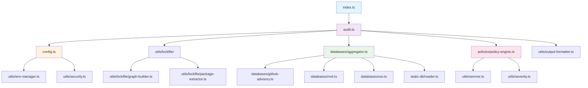

# Component Documentation

Detailed documentation of each major component in `pnpm-audit-hook`.

## Table of Contents

- [Core Components](#core-components)
- [Data Sources](#data-sources)
- [Utilities](#utilities)
- [CLI Tools](#cli-tools)

---

## Core Components

### 1. Hook System (`src/index.ts`)

**Purpose**: Integration point with pnpm's lifecycle hooks.

**Key Exports**:
```typescript
export function createPnpmHooks(): PnpmHooks
export { runAudit, EXIT_CODES } from "./audit"
```

**Responsibilities**:
- Create pnpm-compatible hooks object
- Extract runtime context from pnpm
- Handle error reporting with detailed messages
- Re-export public API

**Example Usage**:
```javascript
// .pnpmfile.cjs
const { createPnpmHooks } = require('pnpm-audit-hook');
module.exports = createPnpmHooks();
```

**Error Handling**:
The hook builds rich error messages including:
- Number of blocked issues
- Package names and versions
- CVE/GHSA identifiers
- Fix version availability

---

### 2. Audit Engine (`src/audit.ts`)

**Purpose**: Orchestrates the entire audit process.

**Key Functions**:
```typescript
export async function runAudit(
  lockfile: PnpmLockfile,
  runtime: RuntimeOptions
): Promise<AuditResult>

export const EXIT_CODES: {
  SUCCESS: 0;
  BLOCKED: 1;
  WARNINGS: 2;
  SOURCE_ERROR: 3;
}
```

**Internal Flow**:
1. Load configuration
2. Extract packages from lockfile
3. Build dependency graph (optional)
4. Aggregate vulnerabilities from sources
5. Evaluate policies
6. Format output
7. Return result

**Performance Features**:
- Parallel source queries
- Cache utilization
- Memory snapshot monitoring
- Auto-prune for cache maintenance

---

### 3. Configuration (`src/config.ts`)

**Purpose**: Load, validate, and merge configuration sources.

**Configuration Hierarchy**:
```
1. .pnpm-audit.yaml (project root)
2. Environment variables (overrides)
3. Built-in defaults (fallback)
```

**Environment Variable Mapping**:
| Env Var | Config Path | Example |
|---------|-------------|---------|
| `PNPM_AUDIT_BLOCK_SEVERITY` | `policy.block` | `critical,high` |
| `PNPM_AUDIT_WARN_SEVERITY` | `policy.warn` | `medium` |
| `PNPM_AUDIT_DISABLE_GITHUB` | `sources.github.enabled` | `true` |
| `PNPM_AUDIT_DISABLE_NVD` | `sources.nvd.enabled` | `true` |
| `PNPM_AUDIT_TIMEOUT` | `performance.timeoutMs` | `30000` |
| `PNPM_AUDIT_CACHE_TTL` | `cache.ttlSeconds` | `3600` |
| `CI` | `output.format` | Auto-detect CI provider |
| `GITHUB_ACTIONS` | `output.format` | `github-actions` |

**Validation Features**:
- Schema validation
- Typo detection (Levenshtein distance)
- Path traversal protection
- Expiration date validation
- Allowlist entry validation

**Security Features**:
- `isSafeRelativePath()`: Prevents path traversal
- `detectMaliciousContent()`: Basic content validation
- Fail-closed on invalid dates

---

### 4. Package Extractor (`src/utils/lockfile/`)

**Purpose**: Extract package information from pnpm lockfiles.

**Module Structure**:
```
lockfile/
├── index.ts              # Barrel exports
├── cache.ts              # Parse caching
├── package-key-parser.ts # Key parsing
├── package-extractor.ts  # Main extraction logic
├── graph-builder.ts      # Dependency graph
└── registry-detector.ts  # Registry detection
```

**Key Functions**:
```typescript
export function extractPackagesFromLockfile(
  lockfile: PnpmLockfile,
  config: AuditConfig
): { packages: PackageRef[]; stats: LockfileStats }

export function buildDependencyGraph(
  lockfile: PnpmLockfile,
  packages: PackageRef[]
): DependencyGraph
```

**Lockfile Version Support**:
- **v6**: Legacy format with `dependencies` section
- **v8**: Current format with `packages` section
- **v9**: Latest with `importers` for workspaces

**Performance Optimizations**:
- Parse caching (`enableParseCache()`)
- Lazy package resolution
- Efficient scoped package handling

---

### 5. Vulnerability Aggregator (`src/databases/aggregator.ts`)

**Purpose**: Coordinate queries to multiple vulnerability sources.

**Architecture**:
```typescript
export async function aggregateVulnerabilities(
  pkgs: PackageRef[],
  ctx: AggregateContext
): Promise<AggregateResult>
```

**Source Execution**:
- Parallel queries with concurrency control
- Individual source timeout handling
- Graceful degradation on failures
- Deduplication across sources

**Deduplication Logic**:
```typescript
// Key: packageName@packageVersion:vulnerabilityId
const key = `${f.packageName}@${f.packageVersion}:${f.id}`;
```

**Metrics Collection**:
- Per-source duration
- Wall-clock time for parallel execution
- Memory snapshots for monitoring

---

### 6. Policy Engine (`src/policies/policy-engine.ts`)

**Purpose**: Evaluate vulnerability findings against configured policies.

**Key Functions**:
```typescript
export function evaluatePackagePolicies(
  findings: VulnerabilityFinding[],
  config: AuditConfig,
  graph?: DependencyGraph
): PolicyDecision[]
```

**Decision Flow**:
1. Check if finding matches allowlist
2. If not allowlisted, check severity against block list
3. If not blocking, check severity against warn list
4. Default to allow

**Allowlist Matching**:
- By vulnerability ID (CVE, GHSA, etc.)
- By package name
- By version range (semver)
- By dependency type (direct-only option)

**Expiration Handling**:
- Date-only strings (`YYYY-MM-DD`) treated as end-of-day UTC
- Invalid dates treated as expired (fail-closed)
- Automatic filtering of expired entries

---

## Data Sources

### 1. GitHub Advisory (`src/databases/github-advisory.ts`)

**API**: GitHub Advisory Database REST API v4

**Features**:
- Query by package name and ecosystem
- Version range matching
- Severity and CVSS scoring
- CISA KEV integration

**Rate Limits**:
- Unauthenticated: 10 requests/minute
- Authenticated: 100 requests/minute

**Authentication**:
```bash
export GITHUB_TOKEN=ghp_xxxxx
# or
export GH_TOKEN=ghp_xxxxx
```

**Caching Strategy**:
- Cache key: `github:{registry}:{package}@{version}:after={cutoff}`
- TTL: Configurable (default 1 hour)
- Invalidation: On static DB version change

---

### 2. NVD (`src/databases/nvd.ts`)

**API**: NIST National Vulnerability Database API 2.0

**Features**:
- CVSS v3.1 scoring
- Detailed vulnerability descriptions
- CPE matching

**Rate Limits**:
- 5 requests per 30 seconds (unauthenticated)
- API key recommended for production

**Authentication**:
```bash
export NVD_API_KEY=your-api-key
```

**Note**: Used for enrichment only, not primary source.

---

### 3. OSV (`src/databases/osv.ts`)

**API**: Open Source Vulnerabilities API v1

**Features**:
- Multi-ecosystem support
- Git-based vulnerability database
- Batch queries

**Rate Limits**:
- No strict limits
- Concurrent request control recommended

**Use Case**: Secondary source for comprehensive coverage.

---

### 4. Static Database (`src/static-db/`)

**Purpose**: Offline vulnerability database for air-gapped environments.

**Schema**:
```typescript
interface StaticDbIndex {
  schemaVersion: 1;
  lastUpdated: string;
  cutoffDate: string;
  totalVulnerabilities: number;
  totalPackages: number;
  packages: Record<string, PackageSummary>;
}

interface PackageShard {
  packageName: string;
  lastUpdated: string;
  vulnerabilities: VulnerabilityRecord[];
}
```

**Performance Features**:
- O(1) index lookup
- Lazy shard loading
- Package-based sharding
- Memory-efficient streaming

**Update Mechanism**:
```bash
pnpm run update-vuln-db:incremental  # Update since last build
pnpm run update-vuln-db:full         # Full rebuild
```

---

## Utilities

### 1. HTTP Client (`src/utils/http.ts`)

**Features**:
- Connection pooling
- Automatic retries with exponential backoff
- Rate limiting
- Timeout handling
- Request deduplication

**Configuration**:
```typescript
const http = new HttpClient({
  timeoutMs: 15000,
  userAgent: 'pnpm-audit-hook',
  retries: 2,
  rateLimit: {
    maxRequests: 100,
    intervalMs: 60000,
  },
});
```

---

### 2. Cache (`src/cache/`)

**Features**:
- File-based persistence
- TTL-based expiration
- LRU eviction
- Memory-mapped reads

**Cache Location**:
```
.pnpm-audit-cache/
├── github/
├── nvd/
├── osv/
└── metadata.json
```

---

### 3. Logger (`src/utils/logger.ts`)

**Features**:
- Level-based filtering (debug, info, warn, error)
- Structured logging support
- Environment variable control

**Configuration**:
```bash
export PNPM_AUDIT_LOG_LEVEL=debug
```

---

### 4. Security Utilities (`src/utils/security.ts`)

**Features**:
- Path traversal protection
- URL validation
- Input sanitization
- Malicious content detection

**Key Functions**:
```typescript
export function isSafeRelativePath(input: string): boolean
export function isSafeUrl(url: string): boolean
export function detectMaliciousContent(input: string): boolean
```

---

### 5. Color Utilities (`src/utils/color-utils.ts`)

**Features**:
- Terminal color support detection
- Severity-based coloring
- CI/CD format detection
- Box drawing utilities

**Exports**:
- Severity colors and labels
- Status icons and colors
- Formatting helpers (indent, truncate, pad)
- Box drawing (horizontalLine, sectionHeader)

---

## CLI Tools

### 1. Setup CLI (`bin/setup.js`)

**Purpose**: Interactive setup for new projects.

**Features**:
- Configuration file generation
- pnpmfile creation
- Environment variable setup

---

### 2. Scan CLI (`bin/cli.js`)

**Purpose**: Standalone vulnerability scanning.

**Features**:
- Manual audit execution
- Multiple output formats
- CI/CD integration

---

## Component Dependencies

